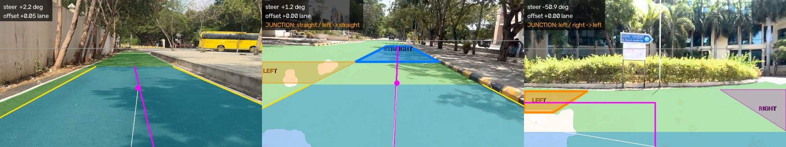
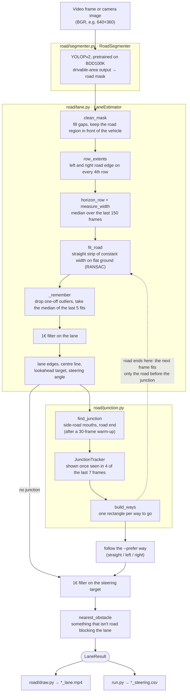

# Lane detection for unmarked roads

Finds the drivable lane and a steering direction on roads with **no lane markings**, such as campus roads with curbs, tree shadows and patched concrete. Everything uses a pretrained model, so nothing needs to be trained.

The whole road is treated as one lane: a straight rectangle on the ground, fitted to the road the model sees and kept stable over time. Where the road splits (a side road, a T-junction or a crossroad), every way to go gets its own rectangle, and the vehicle follows the one you prefer.



*Left to right: plain road; a side road on the left (following straight); a T-junction (the road ends, so the vehicle turns left).*

## Quick start

```bash
python -m venv .venv
.venv/bin/pip install -r requirements.txt   # for a GPU, install a CUDA build of PyTorch (pytorch.org)

.venv/bin/python run.py videos_lowres/road_video.mp4 --csv   # writes outputs/road_video_lane.mp4 + _steering.csv
.venv/bin/python run.py videos_lowres                        # every video in a folder
.venv/bin/python run.py 0 --show                             # live from camera 0, press q to quit
```

The YOLOPv2 weights (`models/yolopv2.pt`) are downloaded on the first run.

`compress_videos.py` turns the original videos in `videos/` into 640×360, 30 fps copies in `videos_lowres/`, so the tests match a low-quality camera. It needs `ffmpeg`.

## Architecture

Each frame goes through three stages:
1. A pretrained network marks which pixels are road.
2. Plain geometry turns that road area into one lane and a steering target.
3. A junction step checks whether the road splits ahead.



### 1. Road segmentation (`road/segmenter.py`)

[YOLOPv2](https://github.com/CAIC-AD/YOLOPv2) is a driving-perception network trained on BDD100K. Only its **drivable-area** output is used; it outputs road even where there are no markings. The frame is resized to 640 px wide and padded to a multiple of 32. On a GPU the model runs in half precision, and pixels with a road probability above 0.5 form the road mask.

`run.py` gives the GPU the next frame before it does the CPU work on the current one. This gives about 50 fps on an RTX 3050 laptop GPU at 640×360, when plugged in: laptop GPUs run far slower on battery.

### 2. From road mask to lane (`road/lane.py`)

**Clean-up and edges.** Small gaps and specks are removed from the mask, and only the road region right in front of the vehicle is kept. On every 4th image row, the leftmost and rightmost road pixels are the road edges. An edge that touches the image border is marked as not really seen.

**Flat-ground model.** The ground is assumed flat and the camera to point forward. On flat ground, a road of constant width looks narrower in proportion to its distance, so fitting road width against image row finds the **horizon** row `y_h`, where the width would shrink to zero. With the horizon known, every road pixel `(x, y)` maps to ground coordinates, with no camera calibration needed:

```
    z = h / (y − y_h)             distance ahead (relative; h = image height)
    X = (x − c_x) / (y − y_h)     sideways position (c_x = image centre column), same units at every distance

         camera image                          ground, seen from above
  ------------------------- horizon y_h
              /    \                               |    :    |
             /      \                              |    o    |  <- lookahead target
            /    o   \                             |    :    |
           /     :    \          ------->          |    :    |     road width W,
          /      :     \                           |    :    |     the same everywhere
         /_______:______\                          |____:____|
                 ^ camera                               ^ vehicle
```

**Fitting the lane.** The road is fitted as a **straight strip of constant width** on the ground: a rectangle that looks like a trapezoid in the image. Its centre line is `X = heading · z + offset`. Each visible edge point gives an estimate of the centre (edge ± W/2), and RANSAC fits the line that most of them agree on. Errors are measured in pixels, so a ragged far edge counts no more than a clean near one. A strip stays stable when one edge is off-screen or the mask is ragged. Curves are approximated by a straight strip that is refitted every frame.

The horizon and the road width barely change, so both are the **median over the last 150 frames** (about 5 s). The width is never less than the road visible on the nearer rows, so the lane always covers the road.

**Steering.** The target is the point on the centre line at `--lookahead` (default 0.4 of the way from the horizon to the bottom of the frame). The steering angle is the direction of that point from straight ahead, based on the camera's horizontal field of view (`--hfov`). `offset` is how far the lane centre is from the vehicle, in lane widths.

### 3. Keeping it stable

The road doesn't change much from one frame to the next, so the lane shouldn't either. Several layers make sure of this:

| Layer | What it stops |
|---|---|
| Long-term medians of horizon and road width (150 frames) | the lane growing or shrinking every frame |
| Outlier gate: a fit more than 0.25 lane widths away from the recent road is skipped, unless that keeps happening for 5 frames in a row (then the road really changed) | one-off bad masks (a shadow or a bright patch) |
| Median of the last 5 fits | jitter; a stray fit can't drag the median |
| [1€ filter](https://gery.casiez.net/1euro/) on the lane values and the steering target | leftover jitter, without lag when the road really turns: it smooths hard when steady and lightly when moving |
| Junction tracker: shown after 4 of 7 frames, hidden after at most 2 of 7, with looser thresholds for a way already shown | junctions blinking on and off |
| Hold the last lane for up to 15 frames if the road is lost | flicker when the model misses a frame |

`--no-stabilize` turns off the 1€ filters, for comparison.

### 4. Junctions (`road/junction.py`)

Junctions are found **row by row in the image**, not in a top-down view. Within one image row, sideways distances on the ground are in proportion to pixels, so each row compares how far the road reaches sideways with the lane's width at that row:

```
 going up the lane, row by row   (# road   . not road   [ ] the lane)

 ....[..........]....   road ends: the middle of the lane is not road,
 ....[..........]....   and there is no road beyond it
 ####[##########]####   side-road mouths: the road reaches well past the lane edge,
 ####[##########]####   further than it usually does along this road
 ..##[##########]##..   ordinary road
 ..##[##########]##..
```

- **Side road:** a band of rows where the road reaches at least 0.5 lane widths past the lane edge, beyond the road's usual overhang. The band must also be deep enough on the ground to be a road.
- **Road end:** the middle of the lane stops being road with no road beyond it, or the road visibly stops short, or it doesn't carry on towards the horizon. A patch the model missed, like a speed breaker, has road again past it, so it doesn't count.
- **Ways:** side roads are assumed to leave at right angles, and each one is drawn 1.5 lane widths out. *Straight* is offered only when the road doesn't end. The vehicle follows the `--prefer` way (default `straight`). If that way isn't there, it falls back to straight, then left, then right.
- When the road ends at the junction, the next frame's lane is fitted only to the road before it, so the crossing road doesn't bend it.
- Junction detection starts after 30 frames, once the road width estimate has settled.

## Output

The annotated video, `outputs/<name>_lane.mp4`:

| On screen | Meaning |
|---|---|
| green tint | road seen by the model |
| blue tint, yellow edges | the lane (the whole road as one rectangle) |
| magenta line and dot | path being followed and its steering target |
| white line | steering direction from the camera |
| grey horizontal line | estimated horizon |
| blue / orange / purple areas | straight / left / right ways at a junction; bold outline = the one followed |
| red line | nearest obstacle in the lane |

The top-left panel shows the steering angle (+ = right), the lane offset, the junction and the way being followed, obstacle and road-lost warnings, and fps.

`outputs/<name>_steering.csv` (written with `--csv`) has one row per frame: `frame, found, steer_deg, offset, obstacle_row, ways, following`.

## Options

| Flag | Default | Meaning |
|---|---|---|
| `--prefer` | `straight` | way to take where the road splits: `straight`, `left` or `right` |
| `--lookahead` | 0.4 | steering target row: 0 = horizon, 1 = bottom of the frame |
| `--hfov` | 70 | camera horizontal field of view in degrees, used for the steering angle |
| `--horizon` | estimated | fixed horizon row as a fraction of image height, for a fixed camera |
| `--average` | 5 | the lane is the median of the last N fits |
| `--no-stabilize` | off | turn off the 1€ smoothing |
| `--out` | `outputs/` | output folder |
| `--show` / `--no-save` / `--csv` | | live window / don't write the video / write the steering CSV |
| `--weights`, `--device` | `models/yolopv2.pt`, auto | model file; `cuda` or `cpu` |

## Code layout

| File | What it does |
|---|---|
| `run.py` | command line: reads a video, folder or camera, runs everything, writes the video and CSV |
| `road/segmenter.py` | `RoadSegmenter`: YOLOPv2 drivable-area mask (`submit`/`collect` for overlapping GPU work) |
| `road/lane.py` | `LaneEstimator`: mask → horizon, width, lane fit, smoothing, steering, obstacles |
| `road/junction.py` | junction detection, `JunctionTracker`, the rectangles for each way |
| `road/filters.py` | `OneEuroFilter` |
| `road/draw.py` | the overlay and the top-left panel |
| `compress_videos.py` | downscales test videos to match the target camera |

## Why this approach

- The roads have no markings, so lane-line models (UFLD and similar) have nothing to detect. Drivable-area segmentation finds road surface instead.
- Only pretrained weights are used, since training wasn't an option.
- Plain edge detection (Canny) breaks down under heavy tree shadows. Curved lane fits in image coordinates were unstable. A constant-width strip on flat ground, fitted with RANSAC, holds up much better.
- A top-down (bird's-eye) view was tried for junctions and dropped: with a low camera, errors in the horizon estimate distort it too much. Comparing within image rows avoids that.

## Known limitations

- It assumes flat ground and a forward-facing camera near the vehicle's centre line. Steep slopes throw off the horizon estimate.
- The model marks a vehicle right ahead as not-road, so the road can look like it ends there and a false turn appears.
- At very wide, open crossroads the straight way can be missed, and only left/right is offered.
- Sun-bleached concrete patches are sometimes marked not-road, which can raise false obstacle warnings.
- Open areas that aren't roads (parking lots, yards) produce unreliable lanes.
