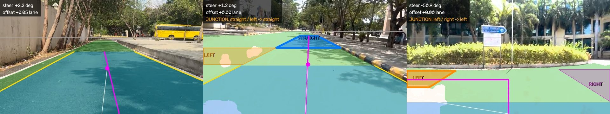
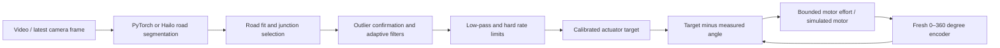

# Lane detection and steering feedback

Detects the drivable road on unmarked roads, estimates a lane, smooths the offset and target direction, reads a 0–360° steering encoder, and computes the motor correction. The same pipeline accepts recordings, a USB camera, or a Raspberry Pi camera.

The default runs the existing YOLOPv2 model and a **simulated encoder/motor**, so it is checkable on a laptop. Physical steering uses a configurable serial bridge. Raspberry Pi capture and Hailo inference adapters are included; real hardware needs its calibrated sensor/driver and a compatible compiled HEF model. See [hardware integration](docs/hardware.md) and [Pi setup](docs/pi.md).



## Run on a laptop

Python 3.10 or newer:

```bash
python -m venv .venv
.venv/bin/pip install -r requirements.txt
.venv/bin/python run.py --config config.json

# Override the source without editing the config:
.venv/bin/python run.py videos_lowres/near_hostel.mp4
.venv/bin/python run.py videos_lowres             # every video in the folder
.venv/bin/python run.py 0 --show                   # USB camera, simulated steering
.venv/bin/python run.py videos_lowres/road_video.mp4 --device cpu --max-frames 30 --no-save
```

CUDA is selected when available; CPU is supported. Weights are downloaded to `models/yolopv2.pt` if absent. `--show` opens a preview; Q/Escape exits. Ctrl-C/SIGTERM, failures and normal completion close the controller and disable its motor output.

Each source writes `outputs/<name>_lane.mp4`, `<name>_steering.csv` and `<name>_summary.json`. The CSV records raw and filtered signals, current and target encoder angles, correction, motor effort, and reasons for disabling control. Video mode processes every frame at the recording's timestamps regardless of inference speed. Live mode drops queued frames and uses elapsed time.

## Configuration

Edit [config.json](config.json); run with `python run.py --config config.json`. Relative paths resolve against the configuration file's directory. Unknown keys and invalid values fail with an error.

| Setting | Meaning |
| --- | --- |
| `source.mode` | `video`, `camera` (OpenCV/USB/V4L2), or `picamera2` (Pi CSI camera) |
| `source.path` | Recording or folder, used in video mode |
| `source.device` | Camera index, or a device path such as `/dev/video0` for OpenCV |
| `source.width`, `height`, `fps` | Requested live capture size/rate; default 640×360 at 30 fps |
| `model.backend` | `torch` for the supplied model; `hailo` for a separate compatible HEF |
| `model.device` | `null` for auto, `cpu`, or `cuda` for PyTorch |
| `lane.smoothing_tau` | Final low-pass time constant, default 0.25 seconds |
| `lane.max_offset_rate` | Maximum offset change, default 0.35 lane widths/second |
| `lane.max_steer_rate` | Maximum target-direction change, default 20 degrees/second |
| `lane.max_dt` | Maximum elapsed time consumed by smoothing after a stall, default 0.1 s |
| `lane.hfov` | Camera horizontal field of view, default 70°; set to your camera's measured FOV |
| `lane.lookahead` | Target row between horizon (0) and image bottom (1), default 0.4 |
| `lane.horizon` | Fixed horizon fraction, or `null` to estimate it |
| `lane.prefer` | Junction preference: `straight`, `left`, or `right` |
| `steering.mode` | `simulation`, `serial`, or `disabled` |
| `steering.center_deg` | Encoder reading when steering is straight |
| `steering.sensor_direction` | +1 if encoder increases when steering right, otherwise -1 |
| `steering.steering_gain` | Measured actuator-degrees per degree of visual target bearing |
| `steering.max_steer_deg` | Allowed encoder travel either side of center, default ±30° |
| `steering.max_rate_deg_s`, `max_accel_deg_s2` | Actuator target velocity/acceleration limits |
| `steering.kp`, `deadband_deg`, `max_command` | Proportional effort gain, angle deadband, normalized effort limit |
| `steering.keep_straight` | Keep a straight course inside the road instead of always seeking its center; default `true` |
| `steering.straight_angle_tolerance_deg` | How close measured steering must be to calibrated straight ahead; default 1° |
| `steering.straight_heading_tolerance_deg` | Maximum road direction difference from the vehicle for keeping straight; default 3° |
| `steering.straight_edge_margin` | Required clearance from either edge, in lane widths, along the visible forward path; default 0.15 |
| `steering.straight_hysteresis` | Clearance allowance while already keeping straight, to avoid toggling; default 0.03 lane widths |
| `output.save_video`, `csv`, `show` | Annotated recording, telemetry and preview switches |
| `output.max_frames` | 0 processes the entire recording / runs the camera continuously |

Lower the smoothing rates or increase the time constant for gentler motion. This increases tracking lag, so tune against the vehicle's speed and steering response. Rates use seconds, not frame counts. The fit median and junction confirmation still use frame windows.

To switch to a live camera, change `source.mode` to `camera` or `picamera2`, set `source.device`, and keep `steering.mode="simulation"` while checking the image and calibration. `output.show=false` works over SSH without a desktop. Disable recording for lower I/O overhead.

The earlier CLI options (`--lookahead`, `--horizon`, `--hfov`, `--prefer`, `--average`, `--out`, `--show`, `--no-save`, `--csv`, `--weights`, `--device`, `--no-stabilize`) remain available. `--no-stabilize` is for comparisons and is rejected with enabled physical steering.

## Smoothing and feedback


```mermaid
flowchart LR
    A[Video / latest camera frame] --> B[PyTorch or Hailo road segmentation]
    B --> C[Road fit and junction selection]
    C --> D[Outlier confirmation and adaptive filters]
    D --> E[Low-pass and hard rate limits]
    E --> F[Calibrated actuator target]
    G[Fresh 0–360 degree encoder] --> H[Target minus measured angle]
    F --> H
    H --> I[Bounded motor effort / simulated motor]
    I --> G
```

The road is fitted as a constant-width strip on approximately flat ground. Near a junction, the selected branch supplies the lookahead target. `offset` is the road center's lateral displacement in **lane widths**, positive to the right; it is not an angle or a distance in meters. To display it as percent, multiply by 100. `steer_deg` is the target's camera bearing, positive right.

The earlier adaptive filter increased its responsiveness during large changes, so it could still pass abrupt jumps. The final output now uses `alpha = 1 - exp(-dt / tau)` and clamps each change to `max_rate * dt`. At 30 fps, the default offset can change by at most **0.01167 lane widths (1.167 percentage points)** per frame, and the visual steering target by **0.667°** per frame. These bounds apply from neutral startup and after reacquisition. `raw_offset` and `raw_steer_deg` mean upstream of this final filter, after the existing geometry/adaptive filters.

Outlier replacement now requires consecutive fits that agree with one another. A missing or rejected fit freezes the last displayed output and marks it held; it cannot continue moving the motor. After the hold window the lane is marked lost. Logged filtered values retain their last value to avoid a false jump to zero. `found=true, held=true` means display continuity, not a fresh observation.

Feedback uses:

```text
requested_steer = clamp(steering_gain * steer_deg, -max_steer_deg, +max_steer_deg)
limited_steer   = velocity/acceleration-limited requested_steer
absolute_target = (center_deg + sensor_direction * limited_steer) % 360
correction      = (absolute_target - measured_angle + 180) % 360 - 180
motor_effort    = clamp(kp * correction, -max_command, +max_command)
```

For example, current 350° and target 10° gives +20°, not −340°. Inside the angle deadband, effort is zero. The encoder represents a single revolution: a multi-turn steering shaft needs an unwrapped/multi-turn sensor and a different adapter.

The visual bearing is not a calibrated vehicle steering angle. Set the gain, center, direction, mechanical travel and motor polarity using your linkage. This implementation provides a proportional position loop; it does not model speed, wheelbase or tire dynamics.

### Continuing straight while off center

With `steering.keep_straight=true`, being off center alone does not demand a turn. If measured steering is near calibrated zero, the vehicle is aligned with the fitted road, and the straight forward path has enough clearance from both edges throughout the visible fit, the requested actuator angle stays **0° relative to straight ahead**. For example, an offset of 0.25 lane widths on a parallel road can continue straight with no centering effort. Road heading is calculated separately from the bearing toward the lane center, which can be nonzero simply because the vehicle is off center.

The default requires 15% of a lane width of clearance to enter this mode and 12% to remain in it. Increase `straight_edge_margin` to reserve more room for the vehicle's width and tracking error; it is an image-derived road-width fraction, not a calibrated vehicle footprint. When clearance shrinks, the road direction changes, the wheels are already turned, or a left/right junction branch is selected, normal steering resumes. Lost/held lanes, obstacles and sensor faults still disable motor effort. Existing target rate/acceleration limits also apply when entering or leaving this mode.

The overlay says **keeping straight** when this policy is active. `holding_straight`, `heading_deg` and `straight_clearance` are recorded in the CSV. `steer_deg`/the overlay's **lane target** still describe the lane-center target; `desired_steer_deg` and `target_steer_deg` describe the actual actuator request. Set `keep_straight=false` to restore continuous centering.

## Motor integration and failure behavior

The serial adapter expects a small controller to read your encoder and drive your motor using the [documented JSON protocol](docs/hardware.md). It is not a generic driver for arbitrary angle-sensor modules. No GPIO pin assignments or device-specific sensor registers are assumed.

Physical output requires a live source, `steering.mode="serial"`, `enabled=true` and `calibrated=true`. Defaults keep hardware unopened. Recorded video always stays virtual during the regression suite.

A held/lost lane, indicated obstacle, stale camera frame, invalid/stale angle, out-of-range angle, update stall or serial failure disables effort. Fresh sensor requests use sequence numbers, so old serial replies are not accepted as new samples. Commands expire after `command_timeout_s`; the bridge firmware must enforce that timeout independently of Python. **Disabling steering effort does not brake the vehicle**; propulsion/braking and emergency stop are outside this repository.

## Tests

```bash
.venv/bin/python -m unittest discover -s tests -v
.venv/bin/python scripts/test_videos.py
```

The regression command runs **every frame** of `near_hostel.mp4`, `nmv_road.mp4`, `perfect_roada.mp4` and `road_video.mp4`, writes annotated videos/CSVs under `outputs/regression/`, checks decoded frame counts, finite outputs, rate limits, circular errors, motor bounds and fault disablement, and produces `report.json`. Use `--no-save` to skip only annotated video output. [Recorded results](docs/test_results.md) describe the completed run and its limits.

Tests also cover spikes, persistent changes, dropped lanes, variable timing, wraparound, sensor faults, serial sequences, resource cleanup, camera buffering and mocked Hailo tensors. These validate software behavior; there is no ground-truth lane annotation or physical Pi/motor test in this workspace.

## Files and limitations

| File | Responsibility |
| --- | --- |
| `run.py`, `road/config.py` | Configuration, pipeline, outputs and resource cleanup |
| `road/capture.py` | Recorded/OpenCV/Picamera2 capture; bounded live frame buffer |
| `road/segmenter.py`, `road/hailo_segmenter.py` | TorchScript and optional Hailo inference |
| `road/lane.py`, `road/junction.py`, `road/filters.py` | Geometry, junctions, outliers and smoothing |
| `road/control.py` | Encoder feedback, simulated/serial motor and faults |
| `road/draw.py` | Lane and steering feedback overlay |
| `scripts/test_videos.py`, `tests/` | Full recordings and hardware-independent tests |

The model is trained on BDD100K and treats the entire detected road as one lane. It assumes a forward-facing camera near the vehicle center and approximately flat ground. Slopes, wide open areas, sharp curves, shadows and washed-out concrete can invalidate the fit. Junction choices and obstacle indications are heuristics; false detections can disable steering. The smoothing bounds do not establish road-following accuracy. Hailo model compilation, camera/sensor calibration, real motor tuning, and device-specific bridge firmware remain deployment requirements.
